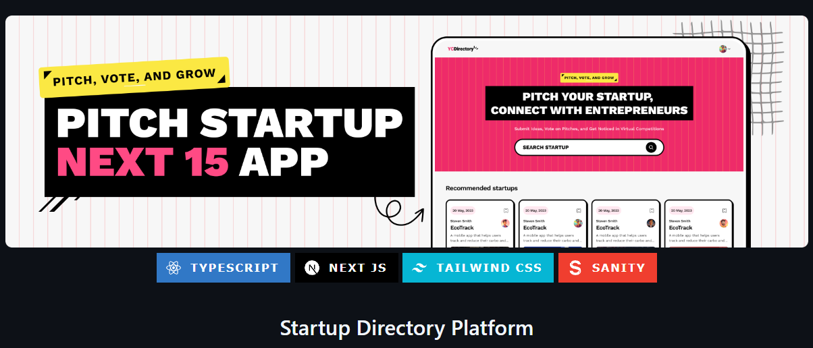

# Coding Along with Adrian (JavaScript Mastery)

Welcome to my coding journey! In this repository, I am following along with Adrian from [JavaScript Mastery](https://www.youtube.com/@javascriptmastery). As an aspiring software developer, I'm using this project to learn best practices and improve my skills.

## 📚 Project Overview

This project showcases the latest features of Next.js 15, including Next.js Form for seamless client-side form submissions, Unstable After for background tasks, Server Component HMR Cache for faster development, and Partial Prerendering for performance optimization.

## 🎥 Video Reference

You can watch the tutorial here: [JavaScript Mastery Tutorial](https://www.youtube.com/watch?v=Zq5fmkH0T78&t=2210s&ab_channel=JavaScriptMastery).

## 🛠️ **Technologies Used**

React 19

Next.js 15

Sanity

TailwindCSS

ShadCN

TypeScript

## 📝 Learning Objectives

Throughout this project, I aim to learn the latest features of such as:

- App Folder Structure

- Client Components vs Server Components

- File-based Routing (including dynamic, nested routes and route groups)

- page, layout, loading, and error Special Files

- Authentication with NextAuth

- Serverless Route Handlers (Next API, API Routes, Full Stack Apps)

- Metadata and Search Engine Optimization (SEO)

- Server Side Rendering (SSR)

- Static Site Generation (SSG)

- Incremental Static Generation (ISR)

- Partial Pre-rendering (PPR)
